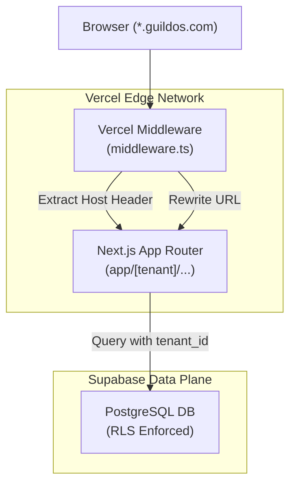

# GuildOS → Retro-Gaming Multi-Tenant Platform: Complete Architectural Blueprint

> **Purpose**: This document is the complete architectural blueprint of the **GuildOS** platform — a production-grade, AI-agentic multi-tenant SaaS for brick-and-mortar retro-gaming storefronts. It serves as the authoritative reference for building the application.

---

## Table of Contents

1. [Executive Summary](#1-executive-summary)
2. [Technology Stack (Exact Versions)](#2-technology-stack)
3. [Repository Structure](#3-repository-structure)
4. [Architecture Overview](#4-architecture-overview)
5. [Database Layer (Supabase + PostgreSQL)](#5-database-layer)
6. [Backend Architecture (Next.js Edge APIs)](#6-backend-architecture)
7. [Frontend Architecture (Next.js App Router)](#7-frontend-architecture)
8. [AI / LLM Integration Engine](#8-ai--llm-integration)
9. [Physical & IoT Integration Architecture](#9-physical--iot-integrations)
10. [Domain Data Models & Real-World Mechanics](#10-domain-data-models)

---

## 1. Executive Summary

GuildOS is an **enterprise-grade, multi-tenant Software-as-a-Service (SaaS) platform** engineered as a distributed, real-time ecosystem for retro-gaming storefronts.

Every physical storefront represents an isolated tenant instance, while a shared global network enables inter-store data aggregation and cross-play mechanics. 

### Core Features
- **Multi-tenancy:** PostgreSQL RLS using JWT `tenant_id` claims, ensuring data isolation at the DB engine level. Subdomain-based dynamic routing handling `*.guildos.com`.
- **AI Vision Ingest ("Loot Scanner"):** Mobile-first camera upload utility with OCR and PriceCharting API integration for automated inventory pricing.
- **Behavioral Mechanics ("The Bounty Board"):** Community-sourced supply chain via gamified quests and faction systems (Sega Syndicate, Nintendo Nomads).
- **Physical Space Monetization ("The Nexus"):** Peer-to-peer LFG boards, physical space rental integrations (Stripe), and encrypted QR access.
- **Agentic Conversational Engine ("Synthetic Shopkeeper"):** DeepSeek-V3 LLM orchestrated to act as an encyclopedic retro-gaming clerk capable of predictive logic ("The Oracle").

---

## 2. Technology Stack

### Frontend & Backend (Monolithic Serverless)
```
Framework:        Next.js 16 (App Router)
Language:         TypeScript
Deployment:       Vercel (Edge Functions + Middleware)
State Management: Zustand
UI Library:       shadcn/ui + Tailwind CSS (Custom thematic skinning)
```

### Database & Infrastructure
```
Database:         Supabase (PostgreSQL 15+)
Auth:             Supabase Auth (JWT)
Storage:          Supabase Storage (Buckets for Vision Integrator images)
```

### AI & Third-Party Integrations
```
AI Engine:        DeepSeek-V3 (via NVIDIA NIM API)
Market Data:      PriceCharting API (Secondary market pricing)
Payments:         Stripe Billing (Nexus sub/recurring billing)
Communications:   Twilio (SMS notifications, Geo-fenced alerts)
IoT / Hardware:   Make/Zapier Webhooks → Govee / Philips Hue Smart LEDs
```

---

## 3. Repository Structure

```
guildos/
├── src/
│   ├── app/
│   │   ├── [tenant]/                  # Tenant resolution catch-all
│   │   │   ├── dashboard/page.tsx     # Merchant RPG Dashboard
│   │   │   ├── bounties/page.tsx      # Public Quest Board
│   │   │   ├── nexus/page.tsx         # LFG Matchmaker & Scoreboards
│   │   ├── api/
│   │   │   ├── ai/shopkeeper/route.ts # Next.js Edge route for DeepSeek-V3
│   │   │   ├── iot/trigger/route.ts   # Webhook triggers for Govee/Philips Hue
│   │   │   ├── vision/appraise/route.ts # Cloud function for image OCR + Pricing
│   │   ├── layout.tsx
│   │   └── globals.css                # Custom retro-thematic CSS variables
│   ├── components/
│   │   ├── dashboard/                 # "Gold Farmed", "Loot Depleted" widgets
│   │   ├── gamification/              # Faction banners, XP trackers
│   │   ├── konami/                    # Client-side DOM keyboard event listener
│   │   └── ui/                        # shadcn components
│   ├── lib/
│   │   ├── supabase/                  # Supabase clients (Server & Browser)
│   │   ├── pricecharting.ts           # PriceCharting API wrapper
│   │   ├── nvidianim.ts               # DeepSeek-V3 wrapper
│   │   └── twilio.ts                  # SMS Broadcast utilities
│   ├── middleware.ts                  # Subdomain routing & JWT validation
│   └── tailwind.config.ts
└── schema.sql                         # PostgreSQL schema with RLS
```

---

## 4. Architecture Overview

### Tenant Isolation & Subdomain Routing



1. **Routing Engine:** The middleware dynamically handles wildcard subdomains `*.guildos.com` and maps apex domains via Vercel's Domain API.
2. **Tenant Resolution:** The host header is extracted, checked against the tenant cache, and the internal URL is seamlessly rewritten to `app/[tenant]/...`.

---

## 5. Database Layer

### Core Design Principles
1. **Multi-Tenancy:** Every table has a `tenant_id` column.
2. **RLS Enforcement:** `ENABLE ROW LEVEL SECURITY` on all tables, filtering rows using `(auth.jwt() ->> 'tenant_id')`.

### Schema Map

```sql
-- TENANTS (Stores)
CREATE TABLE tenants (
    id UUID PRIMARY KEY DEFAULT gen_random_uuid(),
    company_name VARCHAR(255) NOT NULL,
    subdomain VARCHAR(63) UNIQUE NOT NULL,
    created_at TIMESTAMPTZ DEFAULT NOW()
);

-- INVENTORY (Physical Stock)
CREATE TABLE inventory (
    id UUID PRIMARY KEY DEFAULT gen_random_uuid(),
    tenant_id UUID REFERENCES tenants(id),
    item_name VARCHAR(255) NOT NULL,
    market_value NUMERIC(10,2) NOT NULL,
    condition VARCHAR(50) NOT NULL,
    stock_count INTEGER DEFAULT 1,
    status VARCHAR(50) DEFAULT 'ACTIVE' -- ACTIVE, SCRAP, etc.
);

ALTER TABLE inventory ENABLE ROW LEVEL SECURITY;
CREATE POLICY tenant_isolation_policy ON inventory
    FOR ALL
    USING (tenant_id = (auth.jwt() ->> 'tenant_id')::uuid)
    WITH CHECK (tenant_id = (auth.jwt() ->> 'tenant_id')::uuid);

-- PROFILES (Gamified User Accounts)
CREATE TABLE profiles (
    id UUID PRIMARY KEY REFERENCES auth.users(id),
    tenant_id UUID REFERENCES tenants(id),
    display_name VARCHAR(100) NOT NULL,
    faction VARCHAR(50) CHECK (faction IN ('Sega Syndicate', 'Nintendo Nomads', 'Sony Sentinels')),
    xp_points INTEGER DEFAULT 0
);

-- BOUNTIES (Community Supply Chain)
CREATE TABLE bounties (
    id UUID PRIMARY KEY DEFAULT gen_random_uuid(),
    tenant_id UUID REFERENCES tenants(id),
    target_item_name VARCHAR(255) NOT NULL,
    scarcity_mult NUMERIC(3,2) DEFAULT 1.00
);

-- NEXUS LFG (Space Monetization)
CREATE TABLE nexus_lfgs (
    id UUID PRIMARY KEY DEFAULT gen_random_uuid(),
    tenant_id UUID REFERENCES tenants(id),
    creator_id UUID REFERENCES profiles(id),
    lobby_status VARCHAR(50) DEFAULT 'open',
    game_title VARCHAR(255),
    player_slots_total INTEGER,
    player_slots_filled INTEGER DEFAULT 1,
    start_time TIMESTAMPTZ
);
```

---

## 6. Backend Architecture (Next.js Edge APIs)

Because GuildOS is built on the Next.js App Router, the backend logic resides primarily in API routes (`app/api/`) running on Vercel's Edge/Serverless environments.

### Core Workflows
1. **The Auto-Appraiser Engine**: Triggered when a new image hits the Supabase bucket. Extracts metadata, uses OCR to identify the title, fetches real-time value from PriceCharting, and inserts the item into `inventory`.
2. **The Oracle Predictive Logic (Cron Job)**: Matches incoming trade-ins (e.g., "Chrono Cross") against customer purchase vectors (e.g., users with `JRPG` tags). Sends SMS via Twilio if there is a match.
3. **Dynamic Algorithmic Pricing (Cron Job)**: Runs daily at 04:00 UTC. Flags inventory items matching secondary market API spikes ($\ge 15\%$).

---

## 7. Frontend Architecture (Next.js App Router)

### UI / UX Paradigm
GuildOS fundamentally replaces standard e-commerce taxonomy with RPG mechanics:
- "Gross Revenue" $\rightarrow$ **Gold Farmed**
- "High-Value Inventory" $\rightarrow$ **Legendary Item Acquired**
- "Out of Stock" $\rightarrow$ **Loot Depleted**

### The Konami Code Viral Architecture
An easter-egg event listener sits at the layout root.

```javascript
// Konami Code Event Pattern
const konamiSequence = ['ArrowUp', 'ArrowUp', 'ArrowDown', 'ArrowDown', 'ArrowLeft', 'ArrowRight', 'ArrowLeft', 'ArrowRight', 'b', 'a'];
let inputBuffer = [];

window.addEventListener('keydown', (e) => {
  inputBuffer.push(e.key);
  inputBuffer = inputBuffer.slice(-konamiSequence.length);
  if (JSON.stringify(inputBuffer) === JSON.stringify(konamiSequence)) {
    triggerSecretCheatMode(); // Flashes screen neon green, injects 10% discount code
  }
});
```

---

## 8. AI / LLM Integration Engine

**The Synthetic Shopkeeper:**
- **Model:** DeepSeek-V3 via NVIDIA NIM API.
- **Orchestration Layer:** Client queries route through a protected Next.js edge route.
- **Context Injection:** The system securely pulls a minified text-matrix of the store's real-time inventory and injects it into the prompt.

**System Prompt Snippet:**
> "You are an automated, highly advanced retro-gaming clerk running inside GuildOS... You must analyze the provided JSON inventory payload. If asked about stock, query the payload. If an item is absent, check external market patterns to recommend a trade-in bounty value. Never hallucinate store availability."

---

## 9. Physical & IoT Integrations

GuildOS bridges the digital/physical gap through Webhooks and localized IoT arrays.

### "Grail" Item Detection Workflow
When a scanned item has a market value $\ge \$150.00$, the ingest engine hits a webhook:
```json
{
  "event": "loot_drop_legendary",
  "tenant_id": "tenant_time_warp_01",
  "item_name": "EarthBound (SNES)",
  "market_value": 350.00,
  "action_payload": {
    "light_hex": "#FFD700",
    "light_pulse_ms": 3000,
    "audio_url": "https://cdn.guildos.com/assets/sfx/legendary_drop.mp3"
  }
}
```
*Triggers Make/Zapier $\rightarrow$ Philips Hue / Govee LEDs & Smart Speakers in the actual storefront.*

---

## 10. Cross-Play Network (Inter-Store Ecosystem)

### Inter-Guild Trade Routes (B2B)
- **Logic:** If an item sits unfulfilled on a Bounty Board for $> 14 \text{ days}$, the system looks across the `inventory` tables of *other* tenants where `stock_count >= 3`. 
- **Action:** Triggers an automated B2B wholesale transaction proposal.

### The Global Blacklist Security Layer
- **Logic:** Zero-knowledge threat mitigation. Stores log fraudulent/stolen hardware with hashed ID metadata. 
- **Action:** If a scammer attempts a trade-in at another tenant within a 100-mile radius, the backend flashes a high-priority warning to the Synthetic Shopkeeper terminal of that localized store.
